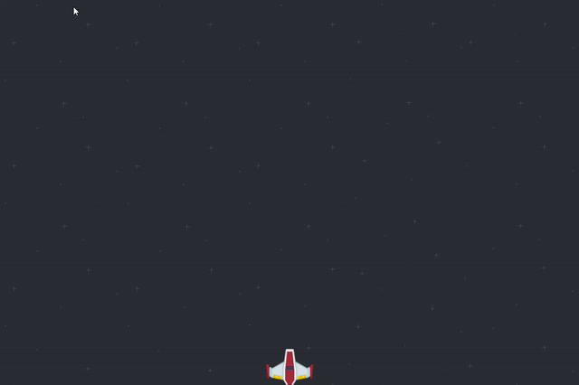

# Alien_Invasion
This is a guided project from python crash course by Eric Mattews.  

the purpose of this project is learning how to use the pygame plugin as well as implementing the concepts in the book.
   
For the project im using git to practice with version control and to properly document my work. ill try to add my own   
ideas as i go along   

5/20/2020:
---
created `alien_invasion.py`, `settings.py`, `ship.py`

5/21/2020
---
added a background to the game    
currently tackling the trail issue with the ship

